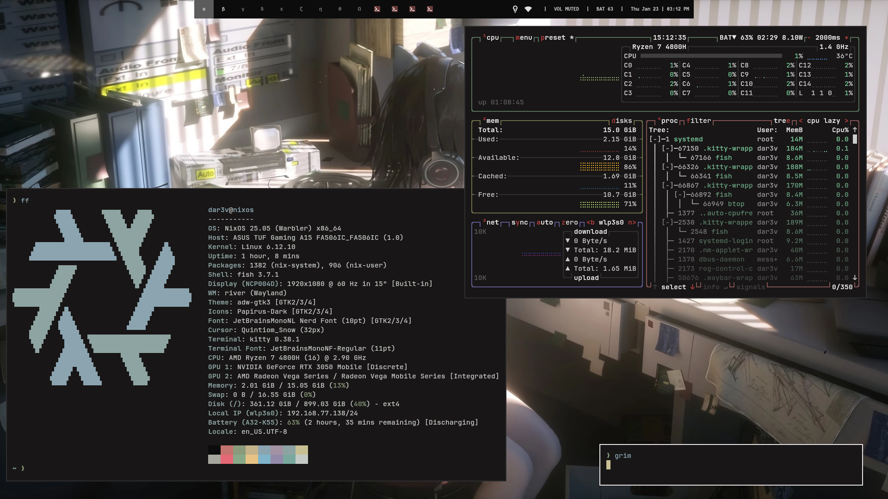
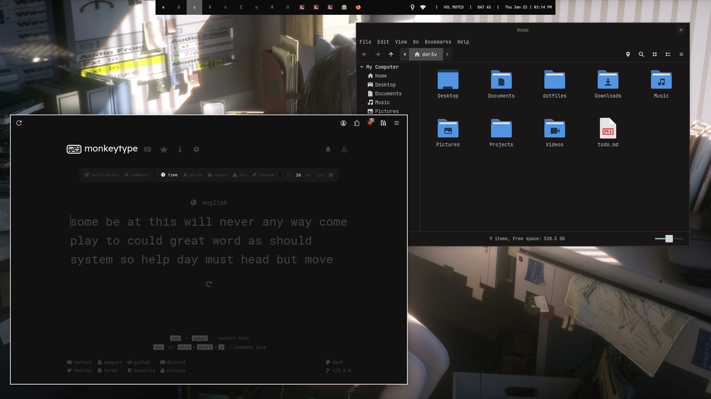
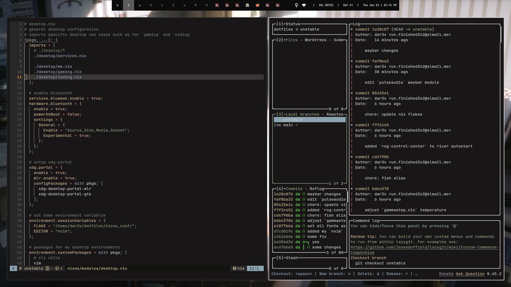

# dotfiles
just another dotfiles



## info
setup info:
- main os: [NixOS](https://nixos.org/)
- second os: [Arch Linux](https://archlinux.org)
- wm: [river](https://codeberg.org/river/river)
- colorscheme: [kanagawa-dragon](https://github.com/rebelot/kanagawa.nvim)
- editor: [nvim](https://neovim.io) + [kickstart.nvim](https://github.com/nvim-lua/kickstart.nvim)
- web browser: [firefox](https://www.mozilla.org/en-US/firefox/new/) + [scientiac/scifox](https://github.com/scientiac/scifox)
- GUI file explorer: [nemo](https://github.com/linuxmint/nemo)

i used [stylix's](https://github.com/danth/stylix) home-manager module for automating theming.

```sh
$ tree -L 2
.
├── configs/ # my configs/rices
│   ├── nvim/
│   └── river_rice/
├── LICENCE
├── nixos_conf/ # my NixOS flake
│   ├── flake.lock
│   ├── flake.nix
│   ├── home-manager/
│   └── nixos/
└── README.md

7 directories, 5 files
```





## dependencies
>[!NOTE]
>
> i forgor 💀

## installation
>[!NOTE]
>
> before all else, install the dotfiles' [dependencies.](#dependencies)

- clone the repo
```sh
$ git clone https://github.com/dar3v/dotfiles
```
- `cd` into `configs/`
- choose a rice (for now its just `river_rice/`) and `cd` into it
- `stow` the files

```sh
$ pwd # current directory
/home/<USER>/dotfiles/configs/river_rice/

$ stow -t $HOME
#      ^^^ there's probably a more elegant way of doing this
```

## todo
- [ ] merge my arch dotfiles
- [ ] modularize nvim config
- [ ] add acknowledgements
- [ ] add (better) documentation
