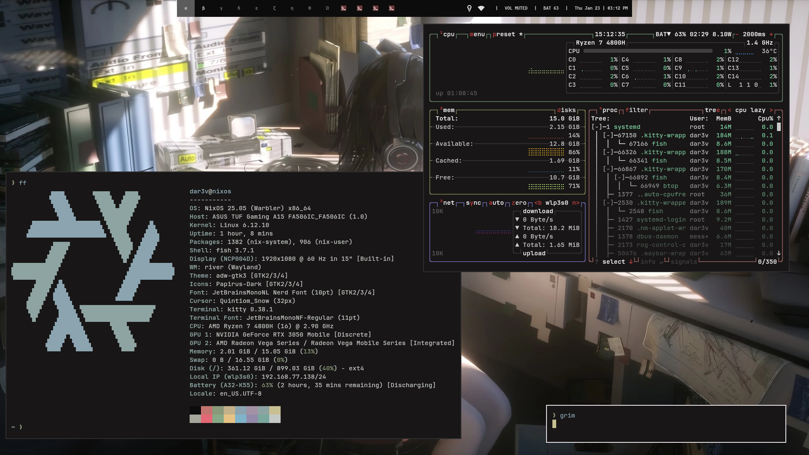
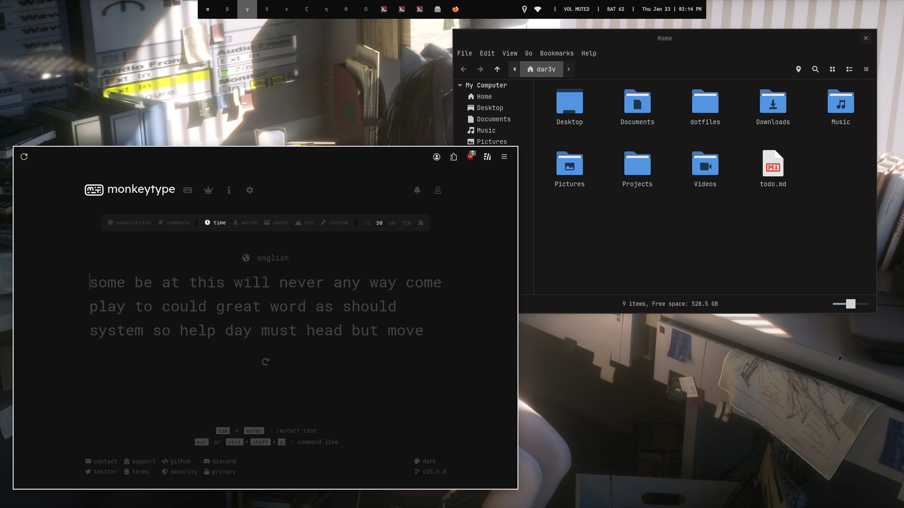
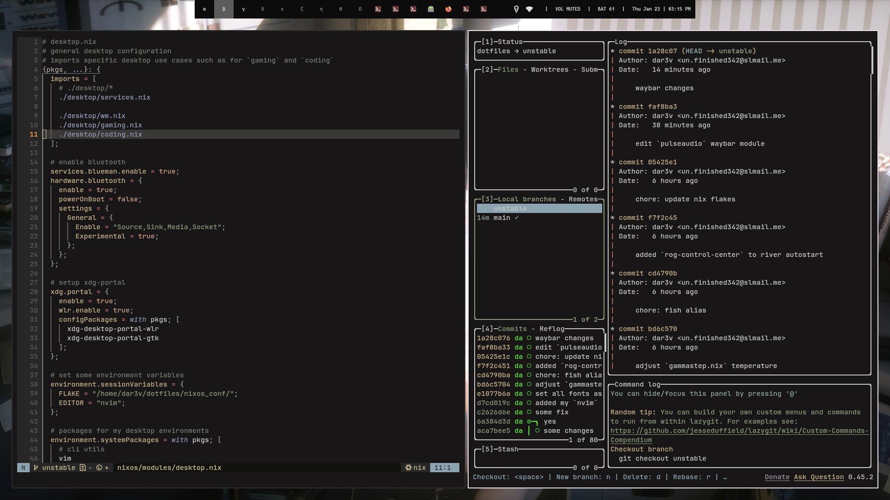

# dotfiles
just another dotfiles



## table of contents
- [info](#info)
- [dependencies](#dependencies)
- [setup](#setup)

## info
setup info:
- main os: [NixOS](https://nixos.org/)
- second os: [Arch Linux](https://archlinux.org)
- wm: [river](https://codeberg.org/river/river)
- colorscheme: [kanagawa-dragon](https://github.com/rebelot/kanagawa.nvim)
- editor: [nvim](https://neovim.io) + [kickstart.nvim](https://github.com/nvim-lua/kickstart.nvim)
- web browser: [firefox](https://www.mozilla.org/en-US/firefox/new/) + [scientiac/scifox](https://github.com/scientiac/scifox)
- GUI file explorer: [nemo](https://github.com/linuxmint/nemo)

i used [stylix's](https://github.com/danth/stylix) home-manager module for automating theming.

```sh
$ tree -L 2
.
├── configs/ # my configs
├── LICENCE
├── nixos_conf/ # my NixOS flake
│   ├── flake.lock
│   ├── flake.nix
│   ├── home-manager/
│   └── nixos/
└── README.md

7 directories, 5 files
```





## dependencies
- i use arch and nixos but u should be able to use these configs for other distros as well (no gurantees however)
- core dependencies:
    - `river`
    - `kitty`
    - `fish`
    - `starship`
    - `neovim`
    - `kanshi`
    - `fnott`
    - `waybar`
    - `rofi`
- utilities u might want (for a better desktop experience)
    - `rofimoji`
        - `wtype`
    - `grim`
    - `slurp`

>[!INFO]
>
> you dont have to install everything here, just the stuff u want to have configured by my dotfiles.

installing every dependencies on **Arch Linux**:
```sh
$ sudo pacman -S river kitty fish starship neovim kanshi fnott waybar rofi rofimoji wtype grim slurp
```

u might also want a web browser.
```sh
$ sudo pacman -S firefox
```

## setup
>[!IMPORTANT]
>
> before all else, install the dotfiles' [dependencies.](#dependencies)

- clone the repo
```sh
$ git clone https://github.com/dar3v/dotfiles
```
- `cd` into `configs/`
- `stow` stow packages that u would like

```sh
$ pwd # make sure u are in the right directory
/home/<USER>/dotfiles/configs/

# stow configs that u want
$ stow -t $HOME river nvim rofi kitty fish starship waybar
```

- my web browser setup:
    - install `firefox`
    - setup [scientiac/scifox](https://github.com/scientiac/scifox).
    - either:
        - use the `sideberry.json` from the [scientiac/scifox](https://github.com/scientiac/scifox) repo.
        - use the `sideberry.json` from this repo.

## todo
- [ ] merge my arch dotfiles
- [ ] stow shell scripts
- [ ] add (better) documentation
